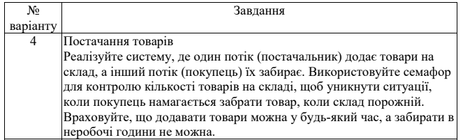

# PracticeWork1

## Explanation of algorithm
- - - 

У алгоритмі моделюється взаємодія між 
"постачальником" **Provider**,"покупцем" **Buyer** і системою відліку часу **Time**.

Ідея полягає в тому, що протягом дня постачальник доставляє пакунки на склад, а покупець їх купує, поки робочий день триває.

+ **Provider** починає роботу з початку дня і доставляє пакунки на склад, коли місце для нових пакунків є вільним.
+ **Buyer** починає роботу о 8 годині ранку і продовжує до 6 вечора. Він чекає на появу пакунків від постачальника і забирає їх зі складу. Кожного разу, коли покупець купує пакунок, звільняється місце для нового.

> Використовуються семафори для контролю кількості вільних і зайнятих місць на складі
